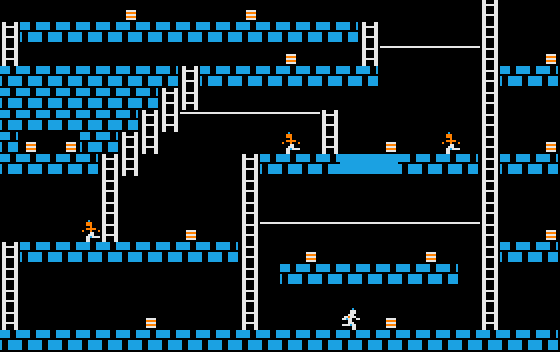
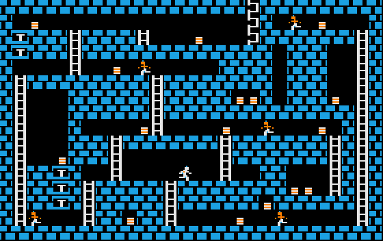
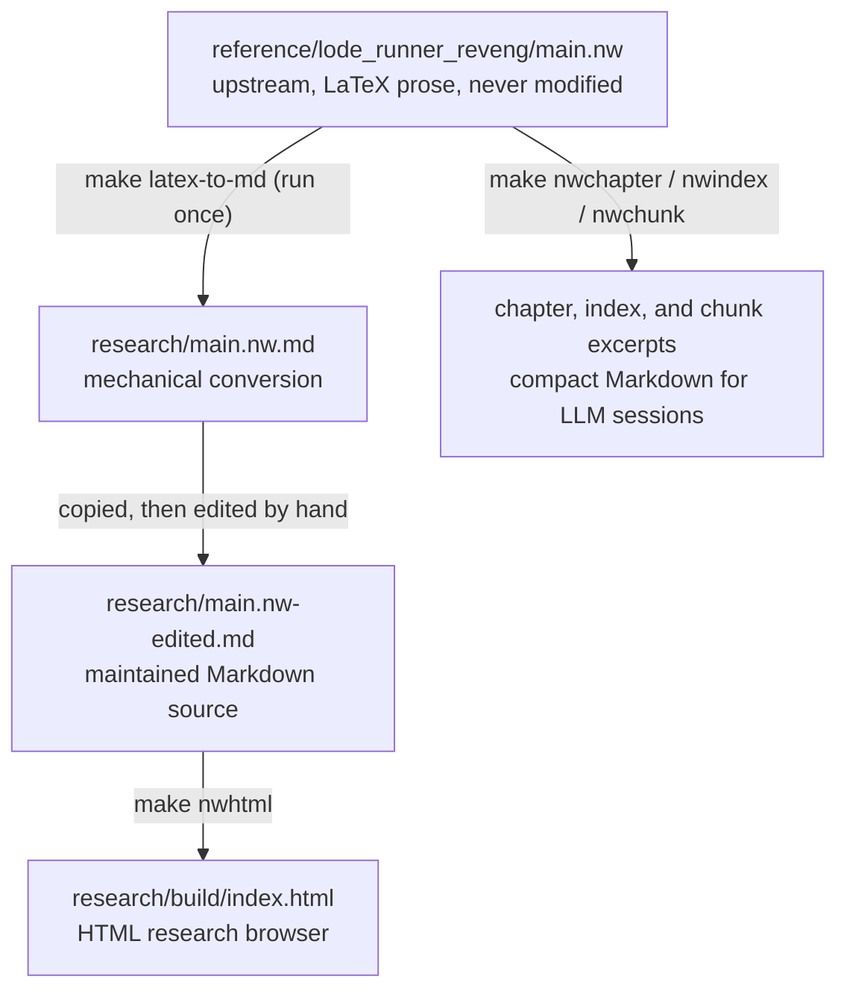

# a2-lode-runner

**Understanding the original Apple II Lode Runner down to its 6502 code, and turning that understanding into a platform-neutral description of the game -- built on XekriRedmane's literate disassembly.**

**Read it online:** <https://fschuhi.github.io/a2-lode-runner/>

<p> </p>

Full level catalogue: <https://fschuhi.github.io/a2-lode-runner/levels.html>

---

## What this is

`a2-lode-runner` is a research project about Doug Smith's *Lode Runner* (Broderbund, 1983) for the Apple II. It works from XekriRedmane's fantastic reverse-engineering project <https://github.com/XekriRedmane/lode_runner_reveng>, whose literate source `main.nw` explains the game's assembly code and assembles byte-for-byte to the original.

The project has two outcomes:

1. **Understanding.** How the original program works: its 6502 implementation, data layout, algorithms, timing, and the interactions between subsystems. This is a result in its own right.
2. **The Core Game Spec.** A platform-neutral description of the game mechanics, precise enough that someone could implement a faithful version of the game from it without reading the 6502 code.

A Godot version of the game is an optional later step, not a goal of the project. The Core Game Spec is written with such an implementation in mind, so that it stays concrete and usable (see "Optional: a Godot version" below).

Where the research currently stands is recorded in `GOALS.md` and `docs/main-nw/index.md`.

---

## Reading the source: the HTML research browser

Upstream, `main.nw` is a noweb document with LaTeX prose, and its reading view is the PDF `main.pdf`. For research that jumps back and forth between prose, code chunks, callers, and identifier definitions, a PDF is cumbersome. So this project converts the source into a static, multi-page HTML site with chunk navigation, identifier links, indexes, and full-text search.

The pipeline is adapted from XekriRedmane's later project `ultima1_reveng`, which uses the same approach. It is complete and considered finished; its planning and reports are kept in `docs/reports/literate-migration/`.



The mechanical conversion `research/main.nw.md` was verified to tangle to exactly the same assembly as the upstream source. The site is published at <https://fschuhi.github.io/a2-lode-runner/>. On every push to `main`, the GitHub Actions workflow `.github/workflows/pages.yml` runs the tests, builds the site with `make nwhtml`, and publishes it to GitHub Pages. The generated site in `research/build/` is never committed; to build it locally, run `make nwhtml` and open `research/build/index.html`.

---

## Running

```
make setup                        # create .venv, install dependencies
make test                         # run the test suite
make nwhtml                       # build the HTML research browser into research/build/
make nwchapter CHAPTER=8          # export one chapter of main.nw as Markdown into tmp/
make nwindex                      # export the chapter/chunk/identifier index
make nwchunk NAME="level draw routine"   # export one named chunk
make sprite-catalog               # regenerate the sprite catalog in research/main.nw-edited.md
make level-ascii LEVEL=1          # print one disk level as an ASCII map
make level-check                  # report counts and problems of all disk levels
make level-images                 # render levels 1 to 150 as PNGs into images/levels/
make level-catalog                # regenerate the level catalog in research/main.nw-edited.md
make filesdump                    # regenerate tmp/filesdump.txt from manifest.lst, for LLM sessions
make patch                        # apply *.patch files from the repo root, for LLM sessions
make help                         # list all targets
```

Developed on macOS. `make help` lists the complete set of targets.

---

## Repository layout

```
a2-lode-runner/
├── .github/workflows/pages.yml   ← Builds and publishes the HTML site to GitHub Pages
├── reference/
│   ├── lode_runner_reveng/       ← Upstream snapshot from XekriRedmane (CC BY-SA 4.0), never modified
│   │   ├── main.nw               ← The literate source (LaTeX prose + 6502 assembly)
│   │   ├── main.pdf              ← Its woven reading view
│   │   ├── weave.py              ← Upstream noweb parser, used by scripts/nwtool.py
│   │   ├── sprite_tables.tex     ← Catalog of all 104 sprites, source of `make sprite-catalog`
│   │   ├── disk/                 ← The disk tracks with level data as HEX listings, input of the level extractor
│   │   ├── README.md             ← Upstream README
│   │   └── PROVENANCE.md         ← Upstream repository, commit, and license
│   └── manuals/                  ← Local only, not committed (see "Sources and evidence")
├── research/
│   ├── main.nw.md                ← One-time mechanical conversion of main.nw to Markdown prose
│   ├── main.nw-edited.md         ← The maintained Markdown source for the HTML browser
│   └── build/                    ← Generated HTML site (`make nwhtml`), not committed
├── docs/
│   ├── main-nw/                  ← Our research notes, one file per researched chapter
│   │   ├── index.md              ← Navigation, noweb conventions, evidence vocabulary, chapter status
│   │   ├── 03-graphics.md        ← Chapter 3: status, findings, and open questions of the annotations
│   │   ├── 06-levels.md          ← Chapter 6: level data, loading, and drawing; level extractor findings
│   │   └── main-index.md         ← Generated chunk and identifier index (`make nwindex`)
│   └── reports/literate-migration/  ← Plan and reports of the HTML-browser subproject (finished)
├── scripts/                      ← Research tools
│   ├── nwtool.py                 ← Chapter, chunk, and index excerpts from main.nw
│   ├── sprite_tables_to_html.py  ← sprite_tables.tex -> HTML sprite catalog (`make sprite-catalog`)
│   ├── level_extractor.py        ← Decodes levels from the disk tracks; ASCII maps and checks (`make level-ascii`, `make level-check`)
│   ├── level_images.py           ← Level PNGs drawn with the level-editor sprites (`make level-images`)
│   ├── level_catalog.py          ← Level catalog for Chapter 6 (`make level-catalog`)
│   ├── latex_to_md.py            ← LaTeX -> Markdown prose conversion (from ultima1_reveng)
│   ├── weave_html.py             ← Markdown noweb source -> HTML site (from ultima1_reveng)
│   ├── weave_lode_runner.py      ← Copy of the upstream Lode Runner parser, used by the two above
│   ├── web/                      ← CSS and JavaScript for the HTML site (from ultima1_reveng)
│   └── PROVENANCE.md             ← Where each adapted file comes from, and under which terms
├── tests/                        ← pytest suite for nwtool.py (with a small noweb fixture), sprite_tables_to_html.py, and the three level scripts
├── tools/
│   └── concat_files.py           ← Filesdump generator for LLM sessions
├── data/                         ← Local only: the disk image, for the `.do` investigation in TODO.md
├── images/                       ← Screenshots (AppleWin), diagrams from lode_runner_reveng, an a2-hires-lab render, and the level images in levels/, used by the HTML site
├── GOALS.md                      ← Roadmap and the current "where we are / what's next"
├── TODO.md                       ← Concrete, startable work
├── HISTORY.md                    ← Record of finished work and decisions
├── LICENSE                       ← MIT (code)
├── LICENSE-CC-BY-SA-4.0.md       ← CC BY-SA 4.0 (research material and documentation)
├── Makefile                      ← All build, test, and tooling commands
├── manifest.lst                  ← File list for filesdump generation
└── requirements.txt
```

`scripts/` holds tools that produce research knowledge; `tools/` holds tools for running the project itself.

---

## Sources and evidence

The project draws on these sources:

- **`main.nw` and `main.pdf`**, in `reference/lode_runner_reveng/`. `main.nw` is the source; `main.pdf` and the HTML browser are reading views of it.
- **The original game**, running in AppleWin, and later in `papple2` (see below).
- **The original disk image**, the one `lode_runner_reveng` reproduces byte for byte. Its README names and links the image. It is not included here.
- **The original manual and cover art**, not included here. The cover art can be seen at [MobyGames](https://www.mobygames.com/game/243/lode-runner/); the manual is available via [Macintosh Garden](https://macintoshgarden.org/games/lode-runner).

For observable behavior, the running original game is the final reference. The manual documents intended player-facing rules. `main.nw` explains implementation and hidden behavior. The disk image holds the original binary and level data.

Research notes label their claims with the evidence vocabulary defined in `docs/main-nw/index.md` (Manual, Code-confirmed, Observed, Inferred, Unresolved). Bugs and quirks of the original are documented as such.

---

## Core Game Spec

Settled findings are promoted from the chapter notes into the Core Game Spec, `docs/core-game-spec.md` (not started yet). The chapter notes keep the explanatory trail, including the 6502 learning along the way; the Core Game Spec keeps only the result: what the game does, in what order, with what timing.

### Scope

The Core Game Spec first covers the core game:

- The 28 by 16 level layout
- The original levels
- Player movement
- Falling and climbing
- Digging
- Temporary holes and brick regeneration
- Gold collection and transport
- Guards and their original chase behavior
- Player and guard interactions
- Death and lives
- Scoring needed by the core game
- Level completion and progression

Deferred, not rejected: the level editor, joystick input, sound, splash screens, attract or demo mode, high scores, saving, settings, between-level presentation, and Apple II hi-res artifact-color effects.

### Principles

Two principles shape the Core Game Spec. Both come straight from the original program, which keeps the stored level apart from the drawn board and updates the game in a fixed order.

1. **Level data is read-only.** The levels decoded from the disk image are never modified. At level start the game copies a level into its own runtime state (holes, collected gold, actor positions) and works on the copy. Restarting a level means copying again.
2. **Game rules are independent of presentation.** The rules that move the player, guards, and holes have no dependency on graphics, sound, or input devices. They advance in fixed steps, in a defined order, and can be driven and checked by tests. A renderer shows the result and feeds in input; it does not contain the rules.

Exact timing belongs to the rules. The relative cadence of player and guard movement, falling, collision checks, digging, and hole regeneration can decide whether later levels are solvable.

---

## Optional: a Godot version

The project began with the goal of porting the game to Godot. That goal is now optional: the Core Game Spec could be turned into a Godot game, and it is written so that this would be straightforward, but the project does not depend on it.

If it happens, this fidelity policy applies:

- Behavioral fidelity: 40%
- Algorithmic fidelity: 25%
- Implementation-study fidelity: 35%

> Preserve observable behavior and important original algorithms where they contribute to the feel or solvability of the game. Study and document the original implementation more deeply than we necessarily reproduce it. Use contemporary Godot facilities rather than emulating Apple II hardware without a gameplay reason.

A Godot version would keep the 28 by 16 board but not the Apple II's graphics memory layout or artifact-color mechanics. Its visual target is clean pixel art with recognizable shapes and matching colors.

---

## Relation to sibling projects

**[`a2-hires-lab`](https://github.com/fschuhi/a2-hires-lab):** an Excel/VBA lab for the Apple II hi-res graphics system, built on Chapter 3 of `main.nw`. Standalone, no shared code. Its findings, such as the direct 1,792-byte shift table that would replace the game's two-stage lookup, feed back into the research here.

**[`papple2`](https://github.com/fschuhi/papple2):** a small Apple II emulator in Python, built as a debugging instrument. It can take this project closer to the running code: letting the original routines load a level and reading the filled buffers, stepping through subroutines, and counting cycles where timing matters. It boots Lode Runner's main program and runs it up to the point where the game reads level data from disk; emulating that DOS 3.3 disk access is the next step there, and the level extractor's output is the reference for what the loaded level must contain.

---

## Project documentation

- `README.md` -- what the project is, its scope, principles, and layout
- `GOALS.md` -- roadmap and the current session pointer
- `TODO.md` -- concrete, startable work and open investigations
- `HISTORY.md` -- record of finished work and decisions
- `docs/main-nw/index.md` -- source navigation and research status per chapter
- `manifest.lst` -- the files that make up an LLM session's context

The LLM collaboration files listed in `manifest.lst` (`CRITICAL_RULES.md`, `LLM_INSTRUCTIONS.md`, `FIRST_PROMPT.md`) are kept out of this repo. Parts of this project were developed in conversation with LLMs; technical claims are checked against `main.nw` and, where possible, against the running game.

---

## License and attribution

This repository contains material under two licenses.

**Code: MIT.** My own code -- `scripts/nwtool.py`, `scripts/sprite_tables_to_html.py`, `scripts/level_extractor.py`, `scripts/level_images.py`, `scripts/level_catalog.py`, the tests in `tests/`, the tools in `tools/`, and the `Makefile` -- is licensed under the [MIT License](LICENSE).

**Research material and documentation: CC BY-SA 4.0.** `main.nw` and the material around it come from [XekriRedmane/lode_runner_reveng](https://github.com/XekriRedmane/lode_runner_reveng), licensed under [CC BY-SA 4.0](https://creativecommons.org/licenses/by-sa/4.0/). Under the same license are:

- the upstream snapshot in `reference/lode_runner_reveng/`;
- the Markdown adaptations in `research/`;
- the HTML pipeline in `scripts/` (`latex_to_md.py`, `weave_html.py`, `weave_lode_runner.py`, `web/`), adapted from XekriRedmane's `lode_runner_reveng` and `ultima1_reveng`; `scripts/PROVENANCE.md` records the sources and XekriRedmane's permission;
- this `README.md` and the other documentation, which quote and build on `main.nw`.

See [`LICENSE-CC-BY-SA-4.0.md`](LICENSE-CC-BY-SA-4.0.md).

*Lode Runner* was written by Doug Smith and published by Broderbund in 1983. Rights in the original game, its manual, and its artwork remain with their holders. Apart from screenshots of the running game in `images/`, made in AppleWin to illustrate the text, and the game's sprites and level data (in `reference/lode_runner_reveng/sprite_tables.tex` and the disk tracks in `reference/lode_runner_reveng/disk/`, the sprite catalog of the HTML site, the level images in `images/levels/`, and one `a2-hires-lab` rendering in `images/`), no part of the original game is included in this repository.
